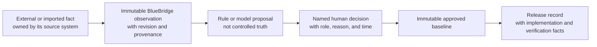

# The BlueBridge authority model

Status: product explanation

Snapshot: 13 September 2026

## The central decision

BlueBridge does not try to become the source of every fact. It records where a fact came from, controls the product-evidence decisions derived from that fact, and freezes reviewed decisions in a baseline.

That sounds like a small distinction. It changes the product design.

A Git commit is authoritative for the code at that commit. Jira is authoritative for a ticket's text, assignment, and workflow state. An imported document revision is authoritative for the words supplied by its author. BlueBridge is authoritative for the reviewed evidence versions, relationships, decisions, baselines, and releases that BlueBridge controls.

Synchronization does not transfer authority. If Git, Jira, or a document changes, BlueBridge records a new observation and raises drift or review work. The external change does not rewrite an approved evidence version.

## Five kinds of record

| Record | What it can establish | What it cannot establish |
| --- | --- | --- |
| External fact | What a source system contained at a named revision | That the content is an approved BlueBridge design-control decision |
| Observation | What BlueBridge captured, when, and from where | The intent behind code or the correctness of a supplied statement |
| Proposal | A question, candidate, possible impact, or missing link for review | A confirmed relationship, approved requirement, or regulatory conclusion |
| Human decision | Acceptance, rejection, revision, deferral, waiver, or approval within the actor's permission | Facts outside the decision scope or an approval that cascades to child records |
| Baseline | The exact reviewed product-evidence state at one point | What shipped unless a release record links implementation and verification facts |

The model has proposal authority only. In practical terms, it may fill a review queue but never empty one by approving its own output.

## Design rules that follow

### Preserve source identity

An import creates a stable source artifact and an immutable revision with a content hash. A later edit creates another revision. Generated candidates cite exact source text or an exact recorded clarification answer.

### Separate observations from decisions

Code can prove that a function, component, or interface exists at a commit. It cannot prove why the product needs it, whether its risk is acceptable, or whether a requirement is approved. BlueBridge can propose those links and route them to the right reviewer.

### Keep semantic similarity out of the trace graph

An embedding match is a retrieval clue. It is not a trace relationship. The UI labels direct, semantic, and collection origins separately. A missing-link action asks a person to consider a relationship; it does not insert one.

### Make approval local

Approval applies to the named object and version. A parent requirement's approval does not approve its children. A passing coherence check does not approve a baseline. A baseline approval does not prove a release shipped.

### Freeze controlled states

An approved baseline contains exact evidence-version membership and baseline-scoped relationships. A later change creates another baseline and supersedes the old one. Old baselines remain available for comparison and document rendering.

### Fail without substituting evidence

If a live model call fails validation or provenance checks, BlueBridge stores a failed run and creates no AI-derived work. Replay requires a separate action and remains labelled as saved output.

### Record reasons, not only states

Controlled decisions store the actor, reason, time, old value, new value, and related IDs. The audit record is append-only at the application level. A waiver binds to the exact deterministic finding fingerprint.

## Worked example

Suppose a repository changes an alert threshold from 30 seconds to 60 seconds.

1. Git remains authoritative for the changed code at the commit.
2. BlueBridge records a code observation tied to that repository, path, and commit. This connector is planned, not implemented.
3. Deterministic traversal and semantic retrieval propose affected requirements, claims, labels, risks, and tests.
4. QA decides which proposed impacts are real. The author changes the controlled candidates.
5. Coherence checks compare the projected candidate state.
6. QA approves a new baseline after the required review work is complete.
7. An author explicitly creates a planned release referencing that baseline and a fictional code revision. WP-20A records manual fictional executions and QA decisions; it does not connect Git or CI.

At no point does the commit silently rewrite a requirement. At no point does a requirement claim that code shipped.

## Comparison with Infera and Ketryx

This is a comparison of public product positioning, not an assessment of either product's internal architecture, validation evidence, or customer configuration. Public pages were reviewed on 13 September 2026.

Infera presents a native medtech compliance platform that imports requirements from document and work systems, connects code and architecture, keeps a living model synchronized, stages changes, and supports approvals, e-signatures, releases, and controlled documents. Its public architecture page says the system continuously updates its model as code evolves. Its requirements page describes centralized management and system-wide impact analysis. See Infera's [platform overview](https://infera.com/), [architecture](https://infera.com/features/architecture), [requirements and traceability](https://infera.com/features/requirements-traceability), and [release management](https://infera.com/features/release-management) pages.

Ketryx presents a connected lifecycle and eQMS platform that works across preferred development tools. Its public pages describe AI-driven QMS enforcement, automatic traceability and documentation, change impact assessment, release orchestration, and recommendations surfaced for human review. See the Ketryx [platform overview](https://www.ketryx.com/product) and [change impact assessment](https://www.ketryx.com/capabilities/change-impact-assessment) page.

| Question | BlueBridge direction | Infera public positioning | Ketryx public positioning |
| --- | --- | --- | --- |
| Where does product truth live? | Authority is split by fact source. BlueBridge owns reviewed evidence and its controlled states. | A native platform centralizes requirements, architecture, risk, verification, releases, and documents. | A connected lifecycle platform spans Ketryx and existing development tools. |
| What happens when code or a source changes? | Store a new observation, raise drift and candidate work, and leave the approved baseline unchanged. | Keep a living architecture model synchronized and stage changes with system-wide impacts. | Analyze connected work, flag affected controls, and guide change impact work. |
| What may AI do? | Ask questions, generate cited candidates, classify a bounded impact set, and propose actions. | Public pages describe agents that extract, author, trace, analyze, and keep models current. | Public pages describe agents that enforce processes, draft records, trace work, analyze impact, and recommend actions. |
| What may AI approve? | Nothing. A named human decides each controlled step. | Public pages describe approvals and e-signatures, but do not expose enough detail to compare every authority boundary. | Public pages state that changes are surfaced for human review and describe approval, refinement, or rejection in the platform. |
| Is semantic similarity a relationship? | No. It stays labelled as a semantic candidate until a person creates a controlled relationship. | Public pages describe automatic tracing. Public material does not expose the exact confirmation boundary for each link type. | Public pages describe automatic traceability and proposed missing links. Public material does not expose the exact confirmation boundary for each link type. |
| Does external synchronization overwrite controlled evidence? | The product rule says no. External changes create observations and review work. | Public pages emphasize continuous synchronization. The exact conflict and authority policy is not public. | Public pages emphasize orchestration and enforcement across connected tools. The exact field-level authority policy depends on product behavior and configuration. |
| What is implemented here? | A narrow fictional source and change workflow with no real connectors, identity assurance, e-signatures, or production QMS claims. | Commercial product capabilities described on Infera's site. | Commercial product capabilities described on Ketryx's site. |

## Where BlueBridge is deliberately stricter

The intended distinction is not that BlueBridge has more features. It plainly does not. The distinction is that each transition between observation, suggestion, decision, baseline, and release must stay visible.

Three constraints carry most of that weight:

- A sync creates an observation or drift record, not an approved edit.
- A semantic match stays outside the confirmed trace graph.
- Passing an automated check and making an approval remain separate events.

These constraints cost clicks and data modeling. They also make a later audit question answerable: who asserted this fact, who accepted its product meaning, what exact evidence state did they approve, and what implementation state shipped with it?

## Where the prototype falls short of the philosophy

The repository demonstrates the record separation, but it does not yet prove production authority controls.

- The author and QA names are simulated values, not authenticated identities.
- The database has no foreign keys and baseline writes are not one explicit transaction.
- Relationship semantics are not yet governed by a ratified, versioned policy.
- Source candidate decisions update candidate rows in place, and source impact decisions rewrite JSON instead of adding decision rows.
- Git, Jira, CI, document-system, and cloud observations are conceptual.
- Release records do not contain verified code, test execution, or output-package facts.
- The prototype has no electronic signature, retention, legal hold, permission administration, or validation package.

The philosophy becomes credible only when those controls exist. Until then, BlueBridge is an evaluation workspace, not a quality-system claim.
