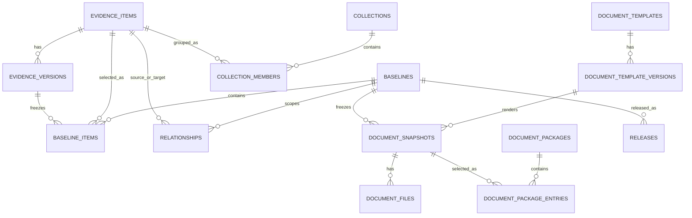
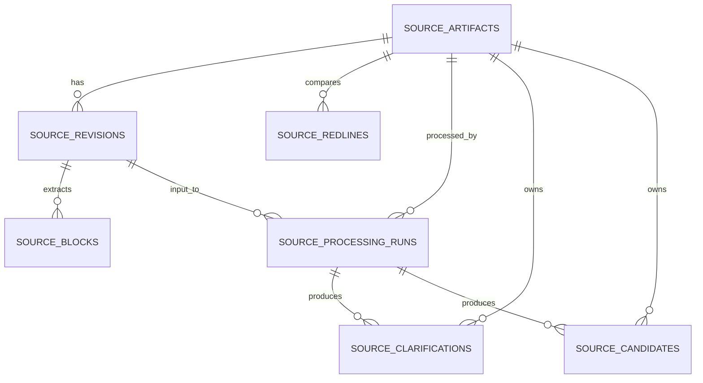
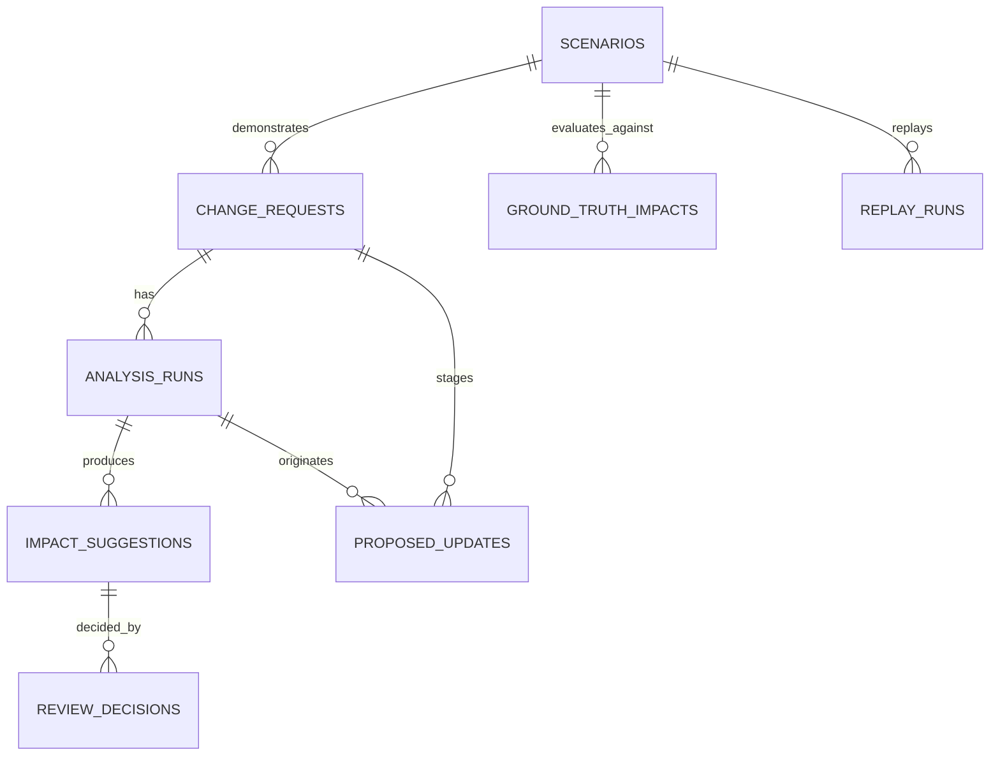

# Data model and database

Status: implementation reference

Snapshot: 18 September 2026

Schema owner: `db/schema.ts`

## Database shape

BlueBridge uses Cloudflare D1 with the SQLite dialect. The local WP-30 schema has 54 tables. D1 stores approved evidence, working changes, model runs, source processing, audit history, deterministic checks, file metadata, document control, and demonstration fixtures. The `RELEASE_FILES` R2 bucket stores immutable file bytes.

The schema follows four rules:

- An evidence item has a stable identity. Its wording lives in immutable evidence versions.
- A baseline selects one version of each evidence item and one set of relationships.
- AI output stays separate from human decisions and approved evidence.
- New observations and proposed changes add records. They do not edit an approved baseline in place.

The 54 tables divide into these ownership groups:

| Group | Tables |
| --- | ---: |
| Evidence, baselines, relationships, and collections | 7 |
| Document templates, snapshots, redlines, files, and packages | 10 |
| Demonstration and evaluation fixtures | 3 |
| Change and relationship review | 7 |
| Verification-plan control | 2 |
| Audit | 1 |
| Coherence checks and dispositions | 3 |
| Embedding cache | 1 |
| Source intake and generation | 7 |
| Release, verification execution, risk, CI evidence, and final approval | 13 |

## Important implementation limits

The current Drizzle schema declares primary keys and indexes, but no foreign keys. Relationships below are logical relationships enforced by application queries and Zod parsing. D1 cannot yet prevent an orphaned `version_id`, `run_id`, or `baseline_id`.

Several multi-table commands use D1 batches in stages. A source-derived or change-derived baseline approval is not wrapped in one explicit transaction across every stage. D1 and R2 cannot commit atomically. The code deletes newly stored objects after a failed D1 write, but a process failure can still leave an orphaned row or object. A production migration must add foreign keys, transaction boundaries, uniqueness rules, reconciliation, and recovery tests.

Timestamps are ISO 8601 strings in `TEXT` columns. Boolean values are SQLite integers. Structured values use JSON encoded into `TEXT`. Identifiers are strings generated by the seed or by an application prefix plus part of a UUID.

## Controlled evidence and baselines



| Table | Purpose | Main columns and rules |
| --- | --- | --- |
| `evidence_items` | Stable identity and current metadata for controlled evidence | `id` is the primary key. `type`, `owner`, `criticality`, and `jurisdictions_json` describe the item. `current_version_id` points logically to `evidence_versions.id`. |
| `evidence_versions` | Immutable wording and approval state | `id` is the primary key. `item_id` groups versions. `version`, `title`, `statement`, `rationale`, `status`, `sources_json`, `flags_json`, `approved_by`, and `approved_at` describe one version. |
| `baselines` | Named controlled product states | `id` is the primary key. `status` is normally `candidate`, `approved`, or `superseded`. Approval actor and time live on the row. |
| `baseline_items` | Version membership of a baseline | Composite primary key on `baseline_id` and `item_id`. `version_id` selects the exact immutable version. |
| `relationships` | Typed evidence links for one baseline | Stores `source_id`, `target_id`, `type`, `baseline_id`, and `active` under `relationship-policy-v1.0`. |
| `collections` | Versioned groups such as test suites, requirement families, and source processing batches | Stores `kind`, `title`, `version`, and `status`. |
| `collection_members` | Explicit collection membership | Composite primary key on `collection_id` and `item_id`. `member_kind` is `evidence` in the current data. Membership creates context, not a direct trace link. |
| `document_templates` | Stable controlled-document identity | Stores the code, current approved version pointer, active or retired state, and retirement decision fields. |
| `document_template_versions` | Immutable template configuration | Stores title, description, selected evidence types, exclusions, section order, package requirement, version, author, lifecycle status, and submission time. |
| `document_template_decisions` | Append-only QA review of template versions | Stores one accepted or rejected decision with actor, reason, and time. An accepted version becomes the current version for the stable template identity. |
| `document_snapshots` | Frozen rendered model for one baseline and template version | Stores exact evidence-version membership, renderer version, input fingerprint, rendered model JSON, and render time. The deterministic ID combines the template version and baseline. |
| `document_files` | R2 metadata for snapshots, redlines, and packages | Stores owner, format, normalized filename, media type, size, SHA-256, generated object key, and creation time. The bytes remain in R2. |
| `document_redlines` | Deterministic comparison of two snapshots from one template | Stores snapshot IDs, algorithm version, fingerprint, template changes, evidence-content changes, actor, and time. PDF and DOCX reports use `document_files`. |
| `document_packages` | Baseline-linked package evaluation | Stores `document-package-v1`, renderer version, input fingerprint, status, manifest JSON, ZIP file reference, author, and time. |
| `document_package_entries` | Exact package membership | Selects one template version and one snapshot per template. |
| `document_package_results` | Individual completeness or integrity result | Stores each pass or blocking result from the package policy. |
| `document_package_decisions` | Append-only QA package decision | Binds accepted or rejected status to the exact package fingerprint with actor, reason, and time. |
| `verification_plan_candidates` | Editable structured TEST plans inside a controlled package | Stores the reserved TEST ID, target risk control, paired relationship proposal, plan content, revision, status, and author provenance. |
| `verification_plan_versions` | Approved structured details for TEST evidence | Keyed by immutable `evidence_version_id`; stores objective, method, acceptance criteria, target control, and approval provenance without creating another plan identity. |
| `releases` | Explicit release record linked to an approved baseline | Discriminates `planned`, `verification_ready`, and immutable `release_approved` states; stores the accepted WP-20A and final-policy run references and decision provenance. One release is permitted per baseline in this prototype. |
| `verification_executions` | Immutable release-scoped TEST execution | Stores baseline and TEST version, outcome, environment, build, observed result, execution time, evidence reference, and author provenance. |
| `verification_execution_decisions` | Append-only QA execution review | Stores accepted or rejected decisions with a required reason. The latest decision for the latest execution controls readiness. |
| `release_readiness_runs` and `release_readiness_results` | Versioned release-readiness evaluation | Store the canonical input fingerprint, `release-readiness-v1` version, actor, outcome, and individual blocker, warning, or pass rows. |
| `residual_risk_assessments` and `residual_risk_decisions` | Release-scoped hazard assessment and QA review | Assessment revisions and decisions are append-only. A new revision becomes current and leaves prior decisions as history. |
| `release_attachments` | Durable release-file metadata | Stores category, normalized filename, media type, size, SHA-256, generated R2 object key, uploader, supersession link, and optional CI-import ownership. |
| `ci_evidence_records` and `ci_evidence_decisions` | Imported GitHub Actions evidence and QA review | Retains valid, invalid, rejected, and replaced manifests. The current import controls the final gate. |
| `prototype_attestations` | Simulated QA and release-approver statements | Stores exact statement version and text, actor, role, reason, timestamp, and controlling fingerprint. These are not compliant electronic signatures. |
| `final_readiness_runs` and `final_readiness_results` | Versioned final-release policy evidence | Stores the `final-release-v1` fingerprint and each blocker, warning, or pass result. A controlling-record replacement makes an older run stale. |

The current evidence types are intended use, claim, user need, requirement, hazard, risk control, component, test, clinical evidence, and label. The database stores the type as text. `lib/domain.ts` defines and validates the allowed values.

## Source intake and generation



| Table | Purpose | Main columns and rules |
| --- | --- | --- |
| `source_artifacts` | Stable identity for an imported source | Stores title, source kind, workflow status, `latest_revision_id`, and creation time. |
| `source_revisions` | Immutable imported content and original-file metadata | Stores content, content hash, origin, capture time, filename, media type, size, SHA-256, R2 object key, extractor identity and version, and warnings. Updating a source inserts a row and changes the artifact's latest pointer. |
| `source_blocks` | Anchored extracted text | Stores revision, ordinal, page or paragraph locator, normalized text, and text hash. Model citations can resolve to these block IDs. |
| `source_redlines` | Deterministic source-revision comparison | Stores the source and revision pair, algorithm version, fingerprint, block and word changes, actor, and time. Repeating the same comparison converges on one record. |
| `source_processing_runs` | Complete record of one source action | Stores source and revision IDs, action kind, live or replay mode, model, reasoning effort, policy version, status, structured input and output, safe error, provider request ID, duration, attempt count, token counts, and creation time. |
| `source_clarifications` | Context questions produced by `source-context-v3` | Stores kind, required or advisory severity, exact citations as JSON, state, answer or decision reason, actor, and update time. |
| `source_candidates` | AI-derived user needs and requirements awaiting QA | Stores candidate type, requirement level, decomposed user-need fields, statement, rationale, origin, status, parent IDs, citations, open advisory IDs, model, policy version, and review fields. |

Source impact suggestions are stored inside `source_processing_runs.output_json`. They are not rows in `impact_suggestions`. A QA decision rewrites that run's output JSON with the decision, reason, and actor. This differs from the change-first flow, which stores each suggestion and each review decision separately.

That difference is acceptable for the prototype but is a poor long-term boundary. Production code should use one normalized suggestion and decision model for both workflows.

## Change analysis and review



| Table | Purpose | Main columns and rules |
| --- | --- | --- |
| `change_requests` | Aggregate root for a proposed evidence change | Stores the optional scenario, anchor item, title, rationale, proposed text, workflow status, creator, timestamps, revision counter, and current analysis run. |
| `analysis_runs` | Live or replay impact run for a change | Stores model and prompt identity, status, structured output, error, supersession links, prior workflow state, provider metadata, attempts, tokens, and time. |
| `impact_suggestions` | One classified candidate from an analysis run | Stores target, category, action, retrieval origin, rationale, graph path, citations, critical flag, and a legacy decision field. Current decisions come from `review_decisions`. |
| `review_decisions` | Append-only QA decisions on change impact suggestions | Stores accepted, rejected, or edited decision, optional replacement action, required reason, actor, and time. The latest row determines the effective decision. |
| `proposed_updates` | Candidate wording or retest work created after impact review | Stores the change, source run, item, old version, target version label, original and proposed text, draft origin, author and edit metadata, and status. |
| `scenarios` | Three fictional change scenarios used by the demonstration and evaluation | Stores display fields, anchor, proposed text, rationale, negative examples, saved drafts, and illustrative metrics. |
| `ground_truth_impacts` | Provisional answer key for scenario evaluation | Composite key on scenario and item. Stores criticality and expected action. The answer key is not production evidence. |
| `replay_runs` | Saved structured impact output for each scenario | Stores scenario, fixture name, displayed model, prompt version, and output JSON. Loading a replay makes no model call. |

The `change_requests.revision` value changes when a candidate draft changes. Coherence results record that revision, which lets the server reject stale results.

## Audit and coherence

| Table | Purpose | Main columns and rules |
| --- | --- | --- |
| `audit_events` | Append-only history for controlled commands | Stores entity and aggregate identities, action, actor, versioned JSON details, schema version, and time. Details contain old and new values, a reason, and references. |
| `coherence_check_runs` | One deterministic check against a baseline or projected candidate | Stores scope, baseline, optional change, candidate revision, status, actor, and time. |
| `coherence_check_results` | Findings emitted by a coherence run | Composite key on run and finding. Stores a stable fingerprint, item, rule code, severity, basis, rule text, expected value, and actual value. |
| `finding_dispositions` | Append-only QA waiver history | Stores scope, finding, exact fingerprint, waiver or removal action, reason, actor, source run, and time. A changed fingerprint invalidates the old waiver. |

Audit references are polymorphic strings rather than foreign keys. The `aggregate_type` and `aggregate_id` pair groups events for a change or baseline. `details_json` has an application-level schema version of 1.

## Embeddings

| Table | Purpose | Main columns and rules |
| --- | --- | --- |
| `embeddings` | Cache for semantic retrieval | Composite primary key on `version_id` and `model`. Stores `item_id`, the vector as JSON text, and creation time. A new evidence version or model gets a distinct cache entry. |

The embedding cache is tied to an evidence version, not only an evidence item. This prevents updated wording from reusing an old vector. The current implementation scans vectors in application memory and calculates cosine similarity there. D1 does not provide the nearest-neighbor query.

## Baseline approval mechanics

Change-first approval performs these steps:

1. Copy every active baseline item into a candidate baseline.
2. Insert a proposed evidence version for each active update.
3. Copy the active relationships into the candidate baseline.
4. Mark proposed versions and updates approved.
5. Point affected evidence items at the new versions.
6. Supersede the previous baseline and approve the candidate.
7. Mark the change approved and append an audit event with old and new membership.

Source-first approval copies the active baseline, inserts approved source candidates as new evidence items and versions, adds `REFINES` links from requirements to generated needs, creates a processing-batch collection, and approves the new baseline. Release creation is a separate explicit command.

WP-20A adds structured verification-plan candidates tied to proposed TEST evidence, approved plan-version details keyed by the immutable TEST evidence version, release-scoped verification executions, append-only QA execution decisions, and versioned readiness runs with individual results. Releases transition only from `planned` to `verification_ready`; this state is narrower than final release approval.

WP-20B adds the second transition from `verification_ready` to immutable `release_approved`. Release files are split deliberately. D1 is authoritative for metadata and control history. The `RELEASE_FILES` R2 bucket holds immutable bytes addressed by generated object keys.

The local WP-30 path uses the same split for original source documents and generated outputs:

1. A PDF or DOCX import stores the original bytes in R2, then stores its metadata, extracted content, and anchored blocks in D1.
2. A source update creates a new revision and a deterministic drift record. It never changes approved evidence.
3. An approved template version and an approved or superseded baseline produce one immutable snapshot fingerprint and two output files.
4. A controlled redline compares two stored rendered models. It does not re-extract the generated files.
5. `document-package-v1` selects the current required approved templates, creates or reuses their snapshots, verifies R2 metadata, writes a manifest, and stores a ZIP.
6. QA can decide only the latest passing package fingerprint. BlueBridge blocks package download until QA accepts it.

The reset path reads every release, source, and document object key. It deletes those R2 objects before it clears dependent D1 rows and restores the seed workspace.

## Schema change process

Edit `db/schema.ts`, then run:

```sh
npm run db:generate
npm run db:embed
```

The first command creates a SQL migration under `drizzle/`. The second command rebuilds `db/runtime-schema.ts`. Application startup checks release, source-revision, and document-template schema markers before applying the embedded bootstrap sequence. A current database is never sent through historical table-rebuild migrations again. A fresh database applies each embedded statement with `CREATE TABLE IF NOT EXISTS` behavior and tolerates duplicate-column errors for `ALTER TABLE` statements.

This bootstrap model fits the demonstration. A production service needs a deployment-time migration ledger, backups, forward and backward compatibility rules, and an operator-visible failure path.
