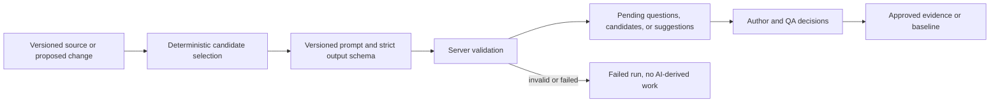

# LLM actions and prompt contracts

Status: implementation reference

Snapshot: 18 September 2026

## Control model

BlueBridge uses a model to propose bounded review work. The model does not own evidence, trace links, review decisions, baselines, or releases.



All live calls use the OpenAI SDK against OpenRouter. The default analysis model is `openai/gpt-5.6-luna` with medium reasoning. Semantic retrieval uses `openai/text-embedding-3-small`. Both are configurable. Responses use `store: false`.

Each completed or failed run records the mode, model, reasoning effort, policy version, input and output, provider request ID, duration, attempt count, token counts, error, and time where the relevant table supports those fields.

## Implemented model actions

| Policy | Trigger | Output | Human gate |
| --- | --- | --- | --- |
| `source-context-v3` | Author analyzes an immutable source revision | Required and advisory context questions with exact source quotes | Author answers, defers, or dismisses each question |
| `user-needs-v2` | Required context is no longer open | Solution-independent user-need candidates with exact provenance | QA approves, rejects, or requests revision for each need |
| `requirements-v2` | User-need review is complete and at least one need is approved | Atomic product, system, or subsystem requirements linked to approved needs | QA approves, rejects, or requests revision for each requirement |
| `impact-v6` | Author analyzes or reopens a proposed change, or a source candidate batch reaches baseline review | One classification for every bounded evidence candidate | QA accepts, rejects, or edits each proposed action |

Replay variants load saved structured JSON and make no model call. The interface labels replay output. Deterministic coherence checks and source-revision drift records also make no model call.

## Semantic impact analysis

### Candidate selection

The change-first pipeline does not ask the model to search the whole product graph.

1. `graphCandidates` traverses active relationships in both stored directions to depth three. These candidates have `linked` origin.
2. The embedding service selects current, non-superseded evidence outside the linked set. It embeds missing evidence versions, embeds the change title, rationale, and proposed text, computes cosine similarity, and keeps the top 12. These candidates have `semantic` origin.
3. `mergeCandidates` keeps linked candidates first, removes duplicate targets, and caps the set at 80.
4. The server derives allowed actions from each evidence type.
5. The model classifies every supplied candidate exactly once.
6. The server adds relevant collection members as deterministic `collection` suggestions if another suggestion did not already cover the target.

The source-first impact path currently uses lexical overlap to pick up to five initial evidence records. It passes the first result as the anchor to the same graph, embedding, and `impact-v6` classifier. It then adds up to six collection suggestions and caps the stored source suggestion set at 16. This is implemented behavior, but the anchor choice is a prototype shortcut rather than the target product design.

### Allowed actions by evidence type

| Evidence type | Allowed actions |
| --- | --- |
| Test | `review`, `retest`, `new_link`, `no_change` |
| Intended use, requirement, component, or label | `review`, `update`, `new_link`, `no_change` |
| Claim, user need, hazard, risk control, or clinical evidence | `review`, `new_link`, `no_change` |

The allowed categories are `hierarchy`, `functional_overlap`, `interface_or_data_flow`, `shared_risk_or_control`, `verification_coverage`, `conflicting_constraint`, `collection_membership`, and `release_coupling`.

### Exact `impact-v6` instructions

The string below is the current instruction passed to the model by `lib/openrouter-provider.ts`.

```text
Support a regulated medical-software QA reviewer by classifying every supplied evidence candidate exactly once. Never omit a supplied candidate: use no_change when no follow-up is warranted. The action must be one of that candidate’s allowedActions. Use review when human assessment is needed but a controlled-text revision or verification rerun is not directly established. Use update only when the candidate statement itself contains the changed value, scope, behavior, or directly affected presentation flow. Use retest only when the test statement directly exercises the changed constraint or affected behavior. When uncertain, use review instead of update or retest. For a population change, review applicable claims, user needs, hazards, controls, and clinical evidence; update intended use and directly affected input, signal-quality, failure-behavior, or use-limitation requirements; and retest directly affected signal-quality or clinician-interpretation tests. Do not update unrelated labels or components or retest unrelated tests merely because the population change is broad. Use new_link only when a person should consider a missing relationship; it proposes rather than asserts that relationship. Choose one supplied impact category. Cite only supplied candidate IDs and always include the target ID. Do not invent evidence, assert or approve a relationship, or approve any evidence or baseline.
```

The input has this shape:

```json
{
  "change": {
    "anchorId": "REQ-004",
    "title": "Change title",
    "rationale": "Why the change is proposed",
    "proposedText": "Candidate controlled wording"
  },
  "allowedActions": ["review", "update", "retest", "new_link", "no_change"],
  "allowedCategories": ["hierarchy", "functional_overlap", "interface_or_data_flow", "shared_risk_or_control", "verification_coverage", "conflicting_constraint", "collection_membership", "release_coupling"],
  "candidates": [
    {
      "id": "TEST-003",
      "type": "test",
      "title": "Evidence title",
      "statement": "Controlled statement",
      "criticality": "high",
      "origin": "linked",
      "path": ["REQ-004", "TEST-003"],
      "allowedActions": ["review", "retest", "new_link", "no_change"]
    }
  ]
}
```

The response contains an array of unique suggestions. Each suggestion has `targetId`, `category`, `action`, `rationale`, and one or more candidate IDs in `citations`.

The server rejects the response unless every target is in the bounded set, every citation is in that set, every candidate appears exactly once, each target is unique, the action is valid for the evidence type, and the citations include the target itself.

## Source context analysis

### Exact `source-context-v3` instructions

```text
Review fictional source material for a regulated medical-software product. Return only material contradictions, ambiguities, missing decisions, and scope questions that affect intended use, user needs, or product requirements. A required question blocks generation only when proceeding would encode an unsupported product choice. An advisory question records useful unresolved context but does not block generation. Treat organizational ownership, operating-procedure responsibility, and future workflow ideas as advisory when a downstream candidate can remain role-neutral without making that choice. A statement of what the current product requires, excludes, or assigns is an explicit current-release decision even when a future alternative or later procedure is mentioned; do not reopen it as a question. Do not ask about any other choice the source already resolves. Quote every conflicting or incomplete source span exactly. Do not answer questions, infer regulatory conclusions, or invent facts. Return an empty questions array when no material question exists.
```

The input contains the source revision ID, title, full extracted content, and a citation contract. Each output question has a kind, required or advisory severity, question, rationale, and one or more source-span citations. For PDF and DOCX inputs, BlueBridge resolves each exact quote to an extracted block ID and a page or paragraph locator before it stores the citation.

The server checks that every citation names the analyzed revision and that every quote occurs exactly in that revision. Duplicate questions and duplicate citations fail schema validation.

## User-need generation

### Exact `user-needs-v2` instructions

```text
Generate concise user needs for a regulated medical-software product. For each candidate, put only a short source-supported user or user-group noun phrase in supportedUser, without a leading article or final punctuation. Put a solution-independent desired-outcome or constraint clause in goalOrConstraint, without a leading requirement phrase or final punctuation. Do not return a requirement statement or prescribe system behavior, components, interfaces, algorithms, or implementation. Use only the source and recorded clarification answers. Cite every material claim, including the user identity, with an exact source span or exact clarification-answer excerpt. Do not repeat the same need in different words. Do not invent users, outcomes, or rationale. Return an empty candidates array when the material supports no user need.
```

The model receives the source revision, resolved clarifications, any approved needs, and separate citation contracts for source spans and clarification answers. Each output candidate contains `title`, `supportedUser`, `goalOrConstraint`, `rationale`, and citations.

The server rejects duplicate titles, duplicate semantic statements, duplicate citations, requirement-like obligations, system prescriptions, and citations that do not exactly match the source or an answered clarification. The server composes the readable statement from the two controlled fields.

## Requirement derivation

### Exact `requirements-v2` instructions

```text
Derive atomic and verifiable product, system, or subsystem requirements from supplied approved user needs. Each candidate must contain one testable shall obligation and refine at least one supplied approved user-need ID. Preserve resolved numbers, units, limits, conditions, and exceptions in the requirement text. Never replace them with phrases such as "approved limit" or "appropriate value". Use only the source and recorded clarification answers, and cite every material claim with an exact source span or exact clarification-answer excerpt. Do not add design choices the supplied material does not support. Do not repeat the same obligation in different words. Return an empty candidates array when no supported requirement can be derived.
```

Each candidate contains `title`, `statement`, `level`, one or more approved user-need IDs in `parentIds`, `rationale`, and citations.

The server requires exactly one `shall` in each statement. It rejects vague placeholders for resolved limits, duplicate candidates, duplicate parent IDs, invalid citations, and parent IDs outside the supplied approved needs.

## Failure and retry rules

Live processing attempts a call at most twice. It retries only timeouts, conflicts, rate limits, and server errors reported by the SDK. Validation and provenance failures stop after the current attempt.

For source actions, a failed run records `output_json` as null and inserts no questions or candidates. For change analysis, a failed run inserts no suggestions, preserves the last successful current run, and restores the previous workflow state. The UI requires the user to retry live processing or choose replay explicitly.

## Actions that are not LLM-backed

The distinction matters in demonstrations and product claims.

| Action | Actual implementation |
| --- | --- |
| Graph candidate discovery | Breadth-first traversal of stored relationships |
| Collection impact | Deterministic lookup of shared collection membership |
| Candidate coherence | TypeScript rules in `lib/coherence.ts`, plus three labelled human-authored fixtures |
| Source revision impact | Deterministic record that finds prior evidence references with a text search over stored JSON |
| Candidate draft creation | Saved scenario fixtures or an author template; no model call |
| Replay | Saved structured fixture output; no model call |
| Evaluation metrics | Database comparison against a locked provisional answer key |
| PDF and DOCX extraction | File signature and package checks, then `unpdf` or Mammoth text extraction |
| Source redline | Deterministic block matching plus word-level comparison |
| Template lifecycle | Role-checked state transitions and append-only QA decisions |
| Controlled output rendering | Deterministic PDF and DOCX rendering from one stored baseline and template version |
| Controlled document redline | Deterministic comparison of rendered models and evidence version IDs |
| Document package | Deterministic completeness, fingerprint, R2 metadata, manifest, and staleness checks under `document-package-v1` |
| Final release | Deterministic `release-readiness-v1` and `final-release-v1` policies over reviewed records |

## Prompt change discipline

Treat a prompt name and its output schema as one versioned contract. If instructions, input selection, allowed values, or validation behavior change materially, create a new policy version. Keep old run metadata readable. Do not relabel an old result with a new policy version.

Before promoting a prompt version, run the offline workflow checks and the opt-in fictional live corpus. Review exact citation validity, invented identifiers, structural failures, critical-impact recall, overall recall, actionable precision, and human corrections. [Prototype prompt evaluation](prompt-evaluation.md) records the latest evidence and its limits.
