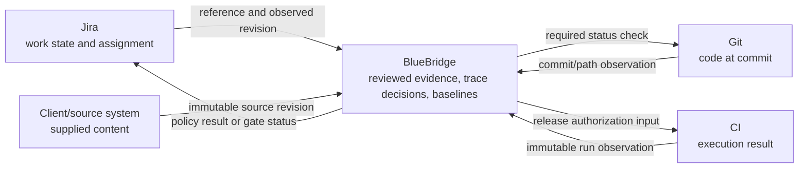
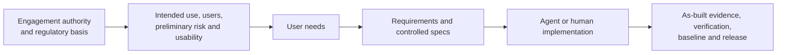

# BlueBridge prototype alignment with the BBT SDLC charter

Status: assessment for discussion  
Assessment date: 15 September 2026
Inputs: BBT SDLC Team Brief v1.2, BBT SDLC Charter v3.4, the current prototype, and the published BlueBridge work packages

## Executive conclusion

BlueBridge currently proves a controlled evidence workspace. It does not yet prove the complete operating model proposed by the BBT SDLC charter.

The prototype directly addresses several of the charter's hardest information-control problems:

- reviewed evidence is stored as structured records rather than made real by a Word export;
- source revisions, model runs, proposals, human decisions, baselines, and releases remain distinct;
- approved states are immutable and changes create new versions;
- trace relationships are typed, reviewable, baseline-scoped, and checked by deterministic rules;
- model output is a proposal, never an approval;
- verification evidence and release readiness are tied to a named baseline.

The prototype only partially addresses the Tier 1 operating concerns. It does not yet provide a first-class specification model, a design-control entry gate, a rigor band, tool-native PR or pipeline enforcement, a production evidence-harvesting path, agentic software-engineering governance, or estimation and capacity planning. Most of those gaps are not covered by the current work-package plan.

The authority philosophy is broadly compatible with the charter's “one record, not two” principle. It is a more precise version of that principle: each fact has one authoritative home, but not every fact must live in one application. Git remains authoritative for code, Jira for work state, CI for executions, source systems for supplied content, and BlueBridge for reviewed product evidence and controlled decisions. References join those facts without copying them into a second set of books.

There are two material philosophical tensions to resolve:

1. The charter says controls should live in developer tooling. The current product direction places most controls in the BlueBridge application and treats Jira, Git, and CI as observed systems. BlueBridge should therefore become a control plane with thin gates in PRs, pipelines, and ticket transitions, while retaining the controlled record centrally.
2. The charter says risk and usability inputs precede requirements. The current source-first workflow derives user needs and requirements before a structured risk or usability step. That sequence should change if the charter position is adopted.

## How to read the assessment

| Label | Meaning |
| --- | --- |
| Demonstrated | Working behavior exists in the prototype and has prototype-level verification. |
| Partial | Some of the required information or control exists, but the charter outcome is not complete. |
| Planned | A named work package explicitly covers the outcome, but it is not delivered. |
| Gap | Neither the current prototype nor a named work package covers the outcome. |
| Tension | The current design or sequence differs from the charter and needs a decision. |

“Demonstrated” is not a regulatory conformity claim. The standards references below reproduce the charter's indicative mapping; they have not been independently assessed against BlueBridge's intended use, QMS, or deployment.

## Tier 1 scorecard

| Charter area | Prototype today | Work-package coverage | Assessment |
| --- | --- | --- | --- |
| Requirements and traceability (§6) | Versioned user needs, requirements, components, risk controls, tests, typed links, review decisions, immutable baselines, and release-linked verification and residual-risk paths | WP-10A/B and WP-20A/B are complete; WP-40 plans repository and Jira observations | Partial. The controlled graph is real, but live requirement-to-code-to-build traceability, data/model provenance, specification governance, and continuous external synchronization are missing. |
| Design controls and rigor (§7) | Item review, change control, traceability checks, baseline approval, verification-readiness checks, residual-risk review, and a fictional final-release gate | WP-30 adds controlled document inputs and outputs | Gap at lifecycle entry. No entry gate, rigor band, per-work-item rigor agreement, use-specification workflow, or as-built Definition-of-Done control is planned. |
| AI-native and agentic engineering (§8) | Versioned LLM policies support source analysis, evidence drafting, and semantic impact proposals; actions and failures are recorded | WP-50 includes cost controls; WP-60 includes model governance | Partial for AI-assisted evidence, gap for AI-generated software. The prototype does not govern coding agents, shared context, agent permissions, PR activity, or coordination at scale. |
| Design input review, approvals, and evidence (§9) | Individual item decisions, attributable prototype audit entries, proposal/decision separation, immutable baselines, manual verification evidence, and simulated WP-20B attestations | WP-40 plans Jira and repository observations; WP-60 covers authenticated signatures | Partial. The record model fits the proposed approach, but parent-before-child enforcement, authenticated identity, electronic signatures, and measured evidence harvesting are absent. |
| Estimation and capacity planning (§10) | No estimate, capacity, Definition-of-Ready, Sprint, person-output, or forecast model | No current work package owns this area | Gap. BlueBridge cannot yet answer the charter's “what would this cost us?” or two-week-output questions. |

## Standards basis used by the charter

This assessment uses the charter's own indicative clause mapping. It explains why a capability is in scope; it does not establish that the proposed control is sufficient or that BlueBridge conforms to the standard.

| Charter area | Basis stated in Charter v3.4 | Product implication |
| --- | --- | --- |
| Requirements and traceability (§6) | ISO 13485:2016 7.3.3, 7.3.10, 7.5.9; ISO 14971:2019 4.5, 5.2, 5.4; IEC 62304 5.1.1, 5.2, 5.2.3, 7.3.3 | Controlled inputs, maintained lifecycle files, and traceability through implementation, risk controls, and verification need evidence in the record. |
| Design controls and rigor (§7) | ISO 13485:2016 7.3.2, 7.3.3, 7.3.5; ISO 14971:2019 4.1, 4.4, 5.1; IEC 62304 4.3, 5.1.1, 5.1.4, 5.2.2; IEC 62366-1 | The project needs planned design controls, stated methods and rigor, risk and usability inputs, and review evidence before downstream release controls can be meaningful. |
| AI-native and agentic engineering (§8) | The charter treats heavy AI code generation as an operating premise rather than citing a standalone agent-engineering clause. Its controls inherit their basis from software planning, methods/tools, risk, review, and record control. | Do not claim a new standard obligation where none is cited. Justify each agent control by the lifecycle activity it performs, the product/process risk it controls, or a recorded agreement. |
| Design input review, approvals, and evidence (§9) | ISO 13485:2016 7.3.5 and 4.2.5; IEC 62304 5.2.6; 21 CFR Part 11 where electronic signatures are relied on | Item-level approval can only serve as review evidence if dependencies, identity, attribution, record control, and applicable signature requirements are enforced. |
| Estimation and capacity (§10) | ISO 13485:2016 5.4.2, 6.1, 7.1; ISO 14971:2019 4.2; IEC 62304 5.1.1, 5.1.2 | Estimates are not presented as a compliance artifact by themselves; they support adequate resourcing, planning, and maintenance of the development plan. |

This basis-first treatment matters for scope. For example, an agent activity log is not required merely because “an auditor may ask for it.” Its fields should be derived from the controlled activity the agent performed, the risk of that activity, the records needed to reconstruct the decision, and any client or QMS agreement.

## Principles and constraints

### Charter §§3–4: guiding principles and what is not viable

| Charter position | Evidence in BlueBridge | Assessment |
| --- | --- | --- |
| Assume heavy AI code generation | The implemented LLMs analyze sources and evidence changes; they do not generate or govern product code. | Gap for the engineering lifecycle. |
| Controls live in the tooling, including PR and pipeline paths | Controls run inside BlueBridge. External developer tools have no working enforcement adapter. | Tension. WP-40 observes fixtures but does not promise enforcement. |
| Evidence is harvested, not separately authored | Source provenance and model-run evidence are captured as work happens. Verification executions are entered manually and developer-tool evidence is not harvested. | Partial; WP-40 is the first connector step. |
| One record, not two | External facts remain owned by their source; BlueBridge owns reviewed evidence and decisions. Sync is designed to create observations and drift, not overwrite approved records. | Strong alignment at the architecture level. |
| Structured data over retrospective documents; diagrams are first-class | The data model is structured and the Matrix and Graph are projections of the same relationship state. Documents are planned as baseline-derived views. | Demonstrated for traceability; WP-30 covers richer document input and output. |
| Design for roadmap volatility | Change sets, immutable versions, impact review, preserved baselines, and explicit new releases support change without rewriting history. | Demonstrated at prototype scope. |
| Fix the day and Sprint first | The product has item-level review flows but no Sprint, refinement, capacity, or normal developer-tool loop. | Gap. |
| Estimable and bounded | A release and change can be bounded, but no MVP/spec estimate or delivery forecast is stored. | Gap. |
| Human and agent work visible in one place | Model runs, proposals, decisions, and reviews are visible within BlueBridge. PR ownership, agent actions, elapsed work, and ticket coordination are not. | Partial. |
| Every control has a clause, risk, or agreement as its basis | Relationship and readiness rules have named policies and findings, but the schema does not require a typed basis on every control. | Gap. |
| Rigor is selected from a published band | No rigor-band object, decision, or enforcement exists. | Gap. |
| No retrospective documentation or export as system of record | Controlled objects and baselines are the record; future documents are projections or snapshots. | Strong alignment. |
| No process dependent on one person | The target role model separates author, reviewer, and approver, but current personas are simulated and operational ownership is not proven. | Partial; WP-50 supplies identity and permissions, not organizational resilience. |

### Charter §5: key constraints

| Constraint | Evidence in BlueBridge | Assessment |
| --- | --- | --- |
| “Zero Token”: use deterministic logic before an LLM | Graph traversal, type rules, coverage checks, release checks, and bounded retrieval reduce what the model decides. | Strong alignment. |
| Evidence must be reproducible | Runs retain policy, model, input/output, timing, and failure data; saved replay is explicit. A future provider model may not reproduce identical semantic output. | Partial. BlueBridge supports provenance and replay, not deterministic regeneration of LLM meaning. |
| A deterministic check admits a model-originated artifact | Structured schemas and provenance validation decide whether model output may enter a review queue; a human decides its meaning. | Aligned if “admits” means structurally admissible, not semantically correct. The charter should make that boundary explicit. |
| Record lives in the system, not an export | Evidence versions, relationships, decisions, baselines, releases, and checks are stored records. | Demonstrated. |
| AI usage policy is a blocking dependency | No policy object or deployment gate covers permitted data, sensitive content, controlled artifacts, or prohibited model use. | Gap; not explicitly owned by WP-50 or WP-60. |
| Data privacy and sovereignty | No production data classification, residency, retention, or provider-routing policy exists. | Gap. WP-50 mentions retention; that is not a complete answer. |
| Full-team access to code and specifications | The prototype has no real identity, permissions, repository access, or first-class specification object. | Gap; identity is deferred to WP-50. |
| Bounded tooling administration | The prototype is intentionally narrow, but setup and maintenance cost have not been measured against buy options. | Unassessed. |
| Quality sign-off authority is recorded per engagement | No engagement-level authority record or sign-off matrix exists. | Gap. |

## Requirements management and traceability (§6)

### What the prototype addresses now

- It separates source material, immutable revisions, clarifications, generated candidates, human decisions, controlled evidence versions, relationships, baselines, and releases.
- It supports prototype-driven elicitation from text or Markdown sources, exact citations, required clarification before generation, review of user needs before requirements, and a stable baseline that survives later source changes.
- Requirements have product, system, and subsystem levels. Components have hierarchical allocation. Relationship semantics and allowed endpoint combinations are governed by `relationship-policy-v1.0` at controlled-prototype status.
- The traceability Matrix, focused Graph, coverage findings, candidate relationship review, and baseline approval all use the same deterministic relationship projection.
- WP-20A closes a fictional requirement/risk-control-to-test-plan-to-execution-to-release-readiness path. It distinguishes a controlled test plan from an execution and from QA's decision on that execution.

### What remains partial or absent

| Charter need | Current position | Required change |
| --- | --- | --- |
| Written, version-controlled requirement/spec granularity convention (§6.1) | Requirements have levels, but “specification” is not a first-class controlled type and the product does not distinguish a design spec from an agent-execution spec. | Define both meanings, their schemas, allowed relationships, split/merge rules, and review policy. |
| Standard prototype handover and costed refactor-versus-rewrite analysis (§6.2) | Source ingestion can baseline derived needs and requirements. Code and document gap analysis is not implemented. | Add a repeatable intake package combining source revisions, repository observations, coverage findings, and a human-owned cost decision. |
| Deliberate record-of-record choice (§6.3) | The architecture makes BlueBridge authoritative for reviewed requirements and Jira authoritative for work state. | Ratify this choice. Jira tickets should reference controlled requirement/spec IDs rather than duplicate their normative text. |
| Dedicated PO ownership (§6.4) | Evidence has owners, but there is no PO role, allocation, onboarding, or backlog authority model. | Treat this as an operating-model dependency, not merely a software feature. Store the engagement responsibility decision if BlueBridge is the control plane. |
| PM and QA reviewability (§6.5) | The UI supports review, but personas are simulated and specifications/code are not connected. | Add authenticated roles, specification views, repository context, and reviewer routing. |
| Bounded spec-driven development (§6.6) | No controlled spec, MVP boundary, estimate, or pre-code Dev plus QA/Test review gate exists. | Add a spec lifecycle and prevent agent/code execution until required reviews pass. |
| Requirement-to-code, test, build, risk, data, and model chain (§6.7) | Requirement/risk-control/test evidence is demonstrated with fictional/manual records. Code, build, dataset, and product-model observations are absent. | Extend WP-40 beyond observation import to stable identities and release-scoped links. Add data and model provenance types. |
| Detail proportional to risk (§6.8) | The generator favors atomic requirements but has no risk-based granularity rule. | Make granularity policy depend on safety/risk classification and allow controlled diagrams to support higher-level low-risk requirements. |
| Decision log and client calendar as standing inputs (§6.9) | Neither is represented. | Prefer linking the existing decision log and calendar over rebuilding them; create immutable observations only where they affect a controlled decision. |

### Interpretation of “one record, not two”

“One record” should mean one authoritative home for each fact, not one database for the whole company.

For example, the requirement statement should not be copied into Jira as another normative requirement. Jira carries the work item and a stable reference to the controlled requirement. Git proves the implementation present at a commit. CI proves what ran and the result. BlueBridge records the reviewed meaning of the links and the baseline or release in which they apply.

That is the recommended direction because it preserves the charter's single-record principle without pretending that BlueBridge authored external facts.

## Design controls and rigor (§7)

The prototype addresses design-control evidence after work has entered BlueBridge. It does not address when design controls engage or how much rigor applies.

The following charter controls are absent from the current system and roadmap:

- a project entry gate covering regulatory basis, intended use and user needs, preliminary risk and usability inputs, an architecture diagram, UI design, and an initial requirements baseline;
- a published minimum/maximum rigor band;
- a selectively applied, recorded rigor agreement per work item;
- a cross-functional risk-analysis workflow that precedes and shapes requirements;
- a controlled use specification and representative-user-session evidence;
- an as-built note—what changed, why, and the linked requirement—as a Definition-of-Done gate;
- a required clause, risk, or client-agreement basis for each control.

WP-20A supplies a useful downstream pattern: a named deterministic rule evaluates the exact baseline, verification evidence is separately reviewed, and the release state changes only through a QA action. WP-20B extends that pattern to residual-risk acceptance and fictional final release approval. It does not correct late design-control entry.

The recommended sequence is:

The current source-first path starts effectively at user needs and requirements. A new design-entry package should precede it.

## AI-native and agentic engineering (§8)

BlueBridge demonstrates disciplined LLM use for lifecycle evidence, not an AI-native software-development lifecycle.

The demonstrated pattern is useful:

- every model action has a named, versioned policy and strict structured-output contract;
- inputs are bounded by deterministic retrieval and graph rules;
- source-derived statements require exact provenance;
- failed calls create no AI-derived evidence;
- semantic similarity stays a review clue rather than becoming a controlled link;
- humans accept, reject, revise, or defer proposals.

An AI-native engineering control plane would also need to record:

- the controlled spec and context package supplied to a coding agent;
- the agent, model, tools, permissions, repository state, and instruction versions;
- the issue, business outcome, and approved scope authorizing the run;
- files, commits, tests, and pull requests produced or changed;
- deterministic checks, reviewer assignments, elapsed time, cost, exceptions, and final disposition;
- the rule that blocks generation or merge when required spec, risk, or review inputs are uncontrolled.

None of the current work packages owns that full outcome. WP-60's model governance is necessary but too late and too broad to substitute for a defined Tier 1 agentic-engineering package.

## Design input review, approvals, and evidence (§9)

The prototype's record model is compatible with the charter's proposed “approval as evidence” approach:

- the item and version being decided are explicit;
- proposals remain separate from decisions;
- decisions record an actor, outcome, rationale, and time;
- baselines preserve the exact approved membership;
- later changes do not alter prior approval evidence.

Four limitations prevent relying on it operationally:

1. Parent approval does not cascade, which is correct, but the system also does not hard-block a child from clearing its gate while its required parent is uncontrolled.
2. Prototype actors are simulated. They are not authenticated identities or electronic signatures.
3. Developer-tool evidence is not yet harvested. WP-40 plans observations, but no measurable QA-SRE pilot or 80% coverage calculation exists.
4. The boundary between attributable agreement and a Part 11 signature has not been enumerated by artifact and decision type.

WP-20B adds simulated attestations and durable attachments. WP-50 can add identity and permissions. WP-60 can add production e-signatures and validation evidence. The item-dependency gate and evidence-harvest measurement should be delivered earlier because they determine whether the §9 model works at all.

## Estimation and capacity planning (§10)

This is the clearest mismatch between the charter and the work-package plan. There is no current or planned model for:

- an estimate attached to a ready requirement or controlled spec;
- an explicit Definition-of-Ready decision;
- a consistent capacity unit and Sprint capacity plan;
- fast forecasting for a set of proposed requirements;
- calibration against observed delivery patterns;
- management overhead for a new workstream;
- documentation and validation work with its own estimate and done state;
- per-role, two-week outcome definitions and automatically generated evidence;
- the comparison of delivery cost with agent/token cost.

This capability should normally remain in the planning system, with BlueBridge owning only the controlled definition, trace links, readiness decision, and immutable observations needed for evidence. Building a competing planner inside BlueBridge would recreate the two-books problem.

## Work-package impact

### What the existing packages genuinely cover

| Work package | Charter contribution | Important limit |
| --- | --- | --- |
| WP-00 | Versioned prompt contracts, preserved runs and failures, source-to-baseline proof | Evidence-assistance lifecycle only; no coding-agent governance or production reproducibility claim |
| WP-10A/B | Governed trace relationships, item decisions, immutable baseline state, Matrix/Graph/gap views | No first-class spec, live code/build/data/model links, or parent-before-child gate |
| WP-20A | Risk-control-to-test readiness, immutable executions, QA decision, release-readiness rule | Manual fictional evidence; no full risk lifecycle, residual-risk acceptance, or final release approval |
| WP-20B | Residual-risk acceptance, final release controls, simulated attestations, durable attachments, and verified import of real CI-run artifacts | Does not cover design-control entry, rigor selection, live GitHub authentication, or Part 11/identity assurance |
| WP-30 | PDF/DOCX inputs, redlines, templates, baseline-linked output packages | Supports controlled views; must not turn exports into the authoritative record |
| WP-40 | Jira mapping and repository/CI observations with non-overwrite behavior | Observation alone does not put controls into PRs, pipelines, and ticket transitions |
| WP-50 | Identity, permissions, durable operations, retention, monitoring, and cost controls | Production foundation; does not define PO, rigor, estimation, or AI-use policy |
| WP-60 | Real connections, quality procedures, model governance, validation evidence, e-signatures | Necessary for operational reliance; too late to settle Tier 1 process semantics |

### Recommended additions before treating the roadmap as a charter implementation

1. **Spec and design-input governance.** Add the two spec types, granularity convention, risk-based detail policy, parent/child approval gates, design-entry package, and basis metadata.
2. **Tool-native control adapters.** Extend WP-40 so BlueBridge can publish required status checks and transition conditions into PR, CI, and work-tracker flows, not merely observe them.
3. **QA-SRE evidence pilot.** Select one workstream, enumerate its quality objectives, map each to a harvested or authored record, measure the harvest rate, and record why the residual cannot be harvested.
4. **Estimation and delivery telemetry.** Add a package that configures the planning system for Definition of Ready, estimates, capacity, and two-week outputs, with BlueBridge references rather than duplicated planning data.
5. **Agentic engineering governance.** Add controlled context packages, agent-run provenance, permission boundaries, tool/action logs, cost, and spec/review gates for AI-generated code.
6. **Engagement authority and policy.** Record regulatory basis, applicable markets, BBT/client quality-sign-off boundaries, AI-use policy, data classification, sovereignty, and the approval-versus-signature map at engagement start.

## Acceptance criteria for the missing Tier 1 capabilities

The following criteria are testable and avoid turning the charter into another narrative layer:

- A reviewer can resolve `requirement -> controlled spec/software item -> test execution -> build` for a named baseline and release, including relevant risk controls.
- A data- or model-dependent requirement resolves to the exact dataset, product-model version, and processing provenance used by the release.
- A required child item cannot pass its review or test gate while its parent is uncontrolled.
- A project cannot enter implementation until its defined entry package is complete or an authorized exception is recorded against the applicable rigor band.
- Every automated or procedural control stores one basis type—standard clause, risk rationale, or client agreement—and its reference.
- A generated artifact enters review only after deterministic structure and provenance checks; semantic acceptance remains an authorized human decision.
- A pull request, pipeline, or ticket transition visibly fails when its applicable controlled prerequisite is unmet.
- Reimporting Jira, Git, CI, or source data creates an immutable observation, converges on the same external revision, and never overwrites an approved BlueBridge record.
- One pilot workstream reports the percentage of quality objectives evidenced from existing tool output and identifies the authored residual.
- A newly ready requirement or spec has an estimate, capacity impact, and planning-system reference within the agreed service time.
- A two-week output summary is generated from normal work records without a separate evidence-authoring exercise.
- Every AI coding action is attributable to a controlled scope, context version, model/tool configuration, repository state, produced change, check result, and human disposition.

## Decisions for senior developers, PMs, POs, and QA/RA

### Product and authority

- Is BlueBridge the controlled evidence workspace only, or the SDLC control plane that also publishes gates into developer tools?
- Is the controlled requirement/spec in BlueBridge the normative record, with Jira carrying workflow and references?
- Which external facts may BlueBridge mirror for convenience, and which must remain reference-only to avoid a second record?
- Which decision types need a recorded agreement, which need an electronic signature, and which do not need approval?

### Requirements and design

- Where does a requirement stop and a design specification begin?
- Is the coding-agent spec the same controlled object as the design spec, a versioned projection of it, or a separate linked artifact?
- Which parent relationships must be controlled before a child can be reviewed, implemented, or tested?
- What risk classification permits higher-level requirements supported by diagrams, and what forces lower-level detail?
- What is the minimum project-entry package, and who has authority to accept an exception?

### Delivery and planning

- What must be true before a requirement or spec is “ready,” and where is that decision enforced?
- What estimation unit works when implementation time falls sharply but review, verification, and coordination remain?
- Which planning facts stay in Jira, and which immutable observations must BlueBridge retain for release evidence?
- What is the promised response time for estimating a new requirement set?
- What constitutes a demonstrable two-week output for each role and workstream?

### AI and evidence

- Which data may be sent to which model providers, in which regions, and under what retention terms?
- What context, tools, and permissions may a coding agent receive before a spec is approved?
- Which automated checks establish structural admissibility, and which judgments always require a person?
- How will a model or policy change affect previously generated, reviewed, and released evidence?
- What percentage of the selected pilot's quality objectives can be harvested, and is 80% a useful target after measurement?

### Regulatory and operating model

- Which charter positions are BBT defaults, which are client-specific, and which depend on the legal manufacturer or notified body?
- Who holds quality sign-off authority on each engagement and for which artifacts?
- Who owns the rigor band, agent policy, relationship policy, and long-term validation of BlueBridge itself?
- Does the applicable reviewer accept structured, tool-generated evidence, and what additional rendered views are needed for review rather than recordkeeping?

## Recommended product position

BlueBridge should be described as a **controlled SDLC evidence and policy plane**, not as the sole home of all lifecycle data and not yet as an eQMS.

That position preserves the strongest existing design choices:

- one authoritative home per fact;
- immutable observations rather than sync-based rewriting;
- AI proposal authority separated from human decision authority;
- structured records and trace links as the source, with documents as reviewed projections;
- deterministic policy checks separated from semantic judgment.

It also accepts the charter's strongest challenge: a control plane is useful only if its decisions reach the developer's normal path. The next architectural step is therefore not to copy more Jira, Git, or CI data into BlueBridge. It is to connect controlled BlueBridge state to thin, visible gates in those tools and harvest the resulting evidence back into the same baseline and release model.
