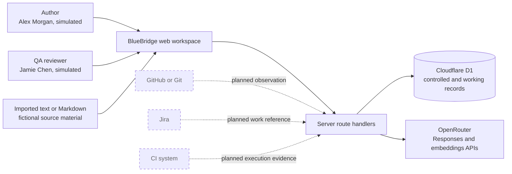
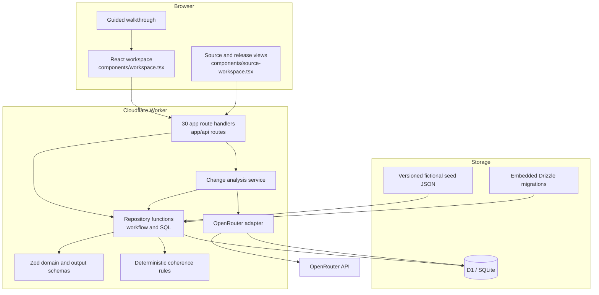
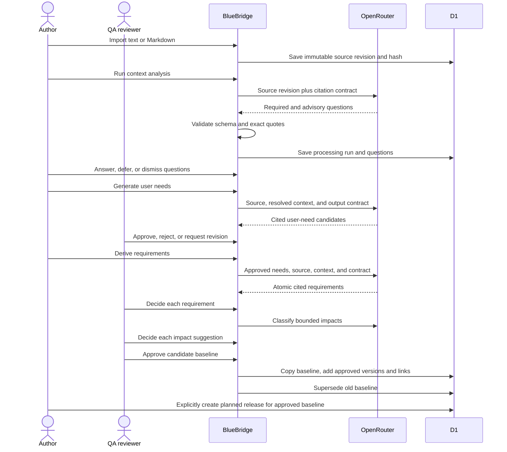
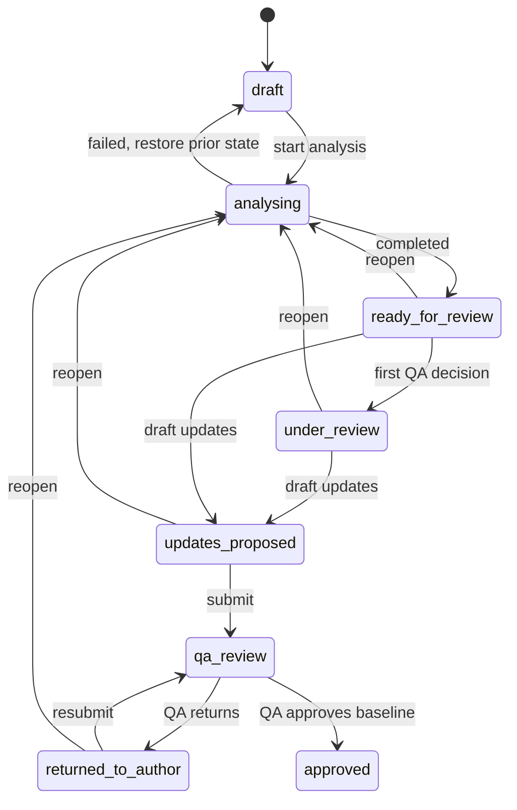

# BlueBridge system architecture

Status: implementation reference

Snapshot: 13 September 2026

## What exists

BlueBridge is a single-product web prototype for controlled SaMD evidence. A React client calls server routes in the same application. The server stores state in Cloudflare D1 and makes optional OpenRouter calls for four bounded AI actions.

The implemented product has two entry paths:

- The source-first path turns an immutable source revision into reviewed user needs and requirements.
- The change-first path assesses the effect of a proposed change on an approved evidence baseline.

Both paths end in human review. Neither path lets a model approve evidence, create a confirmed trace relationship, or approve a baseline.

## System context

The dashed integrations are product direction, not working connectors. The current source import accepts pasted text and Markdown. Live model calls send source or candidate evidence to OpenRouter. The prototype policy permits fictional data only.

## Deployed parts

### Client

`app/page.tsx` mounts one client-side workspace. `components/workspace.tsx` owns navigation and the guided demonstration. Central actor definitions provide Author, QA reviewer, and Release approver identities to every workspace. Dedicated release UI separates prerequisites, residual risk, evidence, QA attestation, and the final decision.

The client validates every successful response with Zod before rendering it. The role selector changes the actor value sent to the server. It does not authenticate a person.

### Server

The route handlers translate HTTP requests into repository calls. Zod schemas validate JSON and multipart input at the server boundary. `lib/final-release-repository.ts` owns residual-risk revisions and decisions, attachment persistence, CI import verification, attestations, final-readiness runs, approval, and reset cleanup. Server checks repeat every UI role restriction.

The repository modules contain SQL and workflow rules together. There is no separate service layer for most commands. This keeps the prototype direct, but it will become hard to test and evolve when integrations and permissions expand.

### Storage

Cloudflare D1 stores controlled records and R2 stores release-file bytes. Drizzle defines D1; runtime code uses prepared SQL. R2 object keys are generated and never use uploaded filenames. Metadata and SHA-256 remain in D1, and downloads force attachment disposition.

`db/runtime-schema.ts` is generated from the Drizzle migrations. Do not edit it by hand. See [Data model and database](data-model.md) for the tables and integrity limits.

### Model provider

`lib/openrouter-provider.ts` and `lib/source-ai.ts` use the OpenAI SDK against OpenRouter's OpenAI-compatible API. The current code has no provider-neutral adapter. Configuration selects the model, embedding model, reasoning effort, base URL, site URL, and application name.

## Source-first workflow

Required questions block generation only while they remain open. The author can defer one with a reason. Advisory questions do not block generation and remain attached to downstream candidates.

A new source revision never edits evidence from an approved baseline. BlueBridge records the new revision, computes a source-drift work item, and requires the source flow to run again.

## Change-first workflow

The analysis pipeline collects direct graph neighbors to depth three, semantic neighbors from embeddings, and members of the same controlled collections. The model classifies the bounded graph and semantic set. Collection suggestions are deterministic additions. QA accepts, rejects, or changes each action and records a reason.

Accepted `update` and `retest` decisions create author-editable candidate drafts. The current draft endpoint does not call a model. Guided scenarios can load saved draft fixtures; other flows use an author template.

Before approval, the server creates a candidate baseline by copying current membership and substituting proposed versions. QA approval marks those versions approved, supersedes the prior baseline, and records the old and new membership in the audit event.

## Coherence checks

The prototype runs repeatable checks for missing verification links, superseded evidence in document views, component inventory gaps, and stale child review after a parent change. It also contains three human-authored evaluation fixtures for timing, claim strength, and review-date consistency.

Candidate checks use an in-memory overlay of proposed statements on the active baseline. Editing a candidate increments the change revision and makes an older check stale. A waiver applies only to the exact finding fingerprint. If the rule inputs change, the waiver does not carry forward.

Baseline approval remains narrower than release approval. `final-release-v1` enforces the accepted WP-20A readiness fingerprint, relationship policy, high traceability gaps, high coherence findings, current accepted residual risks, risk-support attachment, current valid QA-accepted CI evidence, and a current QA risk attestation. Medium coherence findings remain visible warnings.

## Failure behavior

Live model calls retry once for transient HTTP failures. A structural, citation, or provenance failure does not retry. Failed runs store metadata and a safe error, but create no AI-derived questions, candidates, or suggestions.

Replay is a separate user choice. The server never changes a failed live request into replay output. On change reanalysis failure, the server restores the prior change state and current analysis run.

## Trust and control boundaries

| Boundary | Control in the prototype | Production gap |
| --- | --- | --- |
| Browser to server | Zod-valid request and response shapes | No authenticated session or authorization service |
| Server to model | Bounded input, strict structured output, exact citation checks, `store: false` | No data classification, DLP, provider contract control, or key rotation workflow |
| Server to database | Prepared statements and domain parsing on reads | No declared foreign keys and no transaction spanning multi-batch baseline writes |
| AI to controlled evidence | AI records stay pending until a QA decision | Simulated identities do not prove who decided |
| External systems to BlueBridge | Imported CI manifests and report bytes are schema-, commit-, conclusion-, and hash-checked | No live GitHub connector or independent run authentication |
| Baseline to release | Two versioned policies, current-record fingerprints, separate simulated QA and release-approver decisions, and immutable final state | No authenticated identity, compliant e-signature, deployment evidence, or production validation |

## Planned expansion

The approved product direction adds client and product tenancy, real source connections, structured risk and verification, controlled relationship editing, document round trips, durable jobs, permissions, electronic signatures, and release gates. [Delivery plan](delivery-plan.md) records the dependency order. [Product architecture](product-architecture.md) records the target domain and information architecture.
